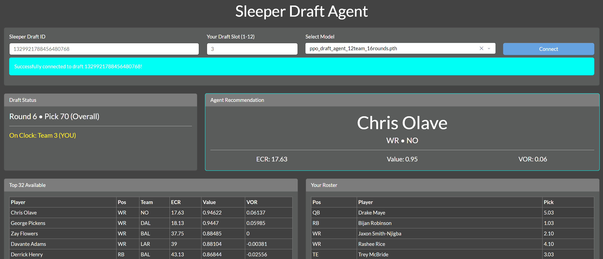

# Sleeper Draft Agent

An AI-powered fantasy football drafting assistant that learns optimal strategies via Reinforcement Learning (PPO) and provides real-time recommendations during your Sleeper draft.

  <!-- Placeholder: Replace with a real screenshot of the dashboard -->

## Key Features

- **Reinforcement Learning:** Utilizes Proximal Policy Optimization (PPO) to train an intelligent drafting agent.
- **Vectorized Training:** Employs parallel environments for efficient training.
- **Cross-Attention Architecture:** The agent's "brain" uses a cross-attention mechanism to weigh player value against roster needs and draft states.
- **Live Draft Assistance:** A Dash-based web dashboard provides real-time pick recommendations during your live or mock Sleeper draft.

## Installation

**1. Clone the Repository**
```bash
git clone https://github.com/your-username/Sleeper-Draft-Agent.git
cd Sleeper-Draft-Agent
```

**2. Create a Virtual Environment (Recommended)**
```bash
python -m venv .venv
source .venv/bin/activate  # On Windows, use: .venv\Scripts\activate
```

**3. Install Dependencies**
First, install the common packages from the `requirements.txt` file:
```bash
pip install -r requirements.txt
```

**4. Install PyTorch**
Next, install the correct version of PyTorch for your system. Visit the [official PyTorch website](https://pytorch.org/get-started/locally/) to get the correct command for your setup. You can check your CUDA Version with `nvidia-smi` in the terminal.

*   **For GPU (NVIDIA with CUDA):**
    ```bash
    # Example for CUDA - use the command from the website!
    pip3 install torch torchvision torchaudio --index-url https://download.pytorch.org/whl/cu130
    ```
*   **For CPU-Only:**
    ```bash
    # Command for CPU-only
    pip3 install torch torchvision torchaudio
    ```

## Instructions

This tool is designed to be customized for your specific league settings. It comes with pre-trained models designed for the following draft setups:

- 10 or 12 team, 15 or 16 round, (1 QB, 2 RB, 2 WR, 1 TE, 1 FLX, 1 K, 1 DST)

>[!NOTE]
> Since rankings are always changing, these preloaded models quickly become out of date. It is always recommended that you retrain shortly before a real draft. 

If you would like to use this application in other league formats, you will need to follow all steps, otherwise, you can skip to Step 3.

### Step 1: Configure Your League

Open `src/config.py` in a text editor. This file contains all the important settings for the training environment. Adjust the following to match your league:

- `NUM_TEAMS`: The number of teams in your league.
- `NUM_ROUNDS`: The total number of rounds in your draft.
- `ROSTER_LIMITS`: The maximum number of players allowed at each position. This is the most subjective setting. Set this to your preferred team composition, adding 1 to RB and WR for flexibility.

Users familiar with training RL models may also want to tune hyperparameters and training settings.

>[!WARNING]
>We use a parallelized training environment to improve convergence speeds. The current settings are optimal for 32 GB of RAM. If you have less, you will need to lower the `NUM_ENVS` value or the training will crash!

### Step 2: Train Your Agent

Once your configuration is set, run the training script from the project root directory:

```bash
python src/train.py
```

- The script will automatically launch **TensorBoard** for live monitoring. Open `http://localhost:6006` in your browser to view training progress (Reward, Loss, etc.).
- Training can take some time, depending on your hardware and the `MAX_EPISODES` setting.
- Upon completion, a final model will be saved in the `src/models/` directory with a descriptive name.

### Step 3: Get Your Sleeper Draft ID

Before you can use the dashboard, you need the ID for your Sleeper draft.

1.  Go to your league's draft page on the Sleeper website.
2.  The URL will look like `https://sleeper.com/draft/nfl/123456789...`.
3.  The long number at the end is your **Draft ID**. Copy it.

### Step 4: Launch the Dashboard

Run the dashboard application from the project root directory:

```bash
python app/dashboard.py
```

1.  Open `http://127.0.0.1:8050/` in your browser.
2.  Paste your **Sleeper Draft ID** into the input box.
3.  Enter **Your Draft Slot** (1-12).
4.  Select the **model you just trained** from the dropdown menu.
5.  Click **Connect**.

The dashboard will now provide live updates and recommendations for each pick in the draft!
